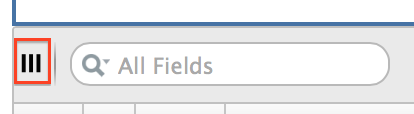

# DifferentialExpressionViewer

Views the results from modules such as ComparativeMarkerSelection (formerly named ComparativeMarkerSelectionViewer), that produce ODF output files of model type "Comparative Marker Selection"

**Author:** Marc-Danie Nazaire (The Broad Institute), Thorin Tabor (University of California San Diego, The Broad Institute)

**Contact:** https://groups.google.com/forum/#!forum/genepattern-help

## Summary
The DifferentialExpressionViewer provides tools for reviewing and working with ODF* result files. 
These tools include plots, a data table, expression profiles, filters, and creating dataset and feature list files. 
(A feature list is a text file with one feature per line.)
\* of Model Type "Comparative Marker Selction"

DifferentialExpressionViewer is an interactive tool. For non-interactive access to annotations, heatmaps, 
and creation of datasets and features lists, see the HeatMapImage, and ExtractComparativeMarkerSelection modules.

## Heatmap/Plots
Heatmap and plots are displayed in the upper portion of the viewer. Use the View menu to select the plot to display:

- **Heatmap** (initially displayed) is a heatmap of the expression values sorted by the test statistic value.
- **Upregulated** Features plots the descending test statistic values versus features sorted by the test statistic value. 
  This plot is useful for visualizing the number of features that have a positive and negative test statistic value in each class.
- **Custom plots**  provide a pair-wise comparison of different statistics. To display custom plots click View > Custom Plot. 
  To compare different significance measures: use the drop-down lists below the plot to select the measures to display 
  on the X and Y axes and click Update. The viewer updates the plot and to reflect the new comparison.
- **Histograms** show the null distributions for each measure of significance.
Use the following File> Save Image menu item to save the heatmap or plot. When saving a heatmap the currently visible 
  rows will be saved by default. Optionally the entire heatmap can be saved by selecting include all features and samples. 
  There is a limit on the size of the heatmap when saving in PNG format. 
  The limit is roughly (number of features * number of samples <= 3580000).
  
## Zoom in/out of plots
Use the mouse to click-and-drag over the plot area to zoom in.

Use the Reset button (upper right of plot) to return the zoom to the default level. 

Note: Zoom in/out not available for heatmap.

## Data Table
The table in the lower portion of the viewer lists the differential expression results. For a description of each column, 
see the documentation for the module that created those results.
By default, the features in the table are ordered by score. 
To reorder the features, click the title of the key column; for example, to order features by rank, click _Rank_.  

To choose which columns are shown in the table, click the Column Show/Hide toggle icon in the top-left corner of the table, 
just to the left of the search bar:

Using File>Save Table, you can export the table in tab delimited format for use in external programs such as Excel. 
This will result in a tab-delimited file with the contents of the table, leaving out any items excluded due to filters 
or columns hidden through the Column Show/Hide toggle.

## Expression Profiles
The expression profile for a feature plots expression value per sample. A heatmap shows the same information, 
but color codes the expression values from red for the highest expression values through blue for lowest expression values. 

To display an expression profile:

1. Select one feature from the data table.
2. Click _View>Profile_.

## Filters
Use filters to display only features that you are interested in:

1. Select _Edit>Filter Features>Create/Edit Filters_. The Filter Features window appears.
2. In the Filter Features window, set your filtering criteria and click OK. The viewer will then only show those features that meet your criteria.
3. To redisplay all features, select _Edit>Remove All Filters_.

## Creating Datasets/Feature Lists
You can use the viewer to create a new dataset in GCT format, or a feature list (a text file with one feature per line) 
containing a listing of the selected features in the table in from the differential expression results:

1. Select the desired features from the table.
2. Select _File>Save Dataset_ or _File>Save Feature List_. A window appears.
3. Choose a location and name for the new dataset/feature list.
4. Click _OK_ to save the new data set/feature.

## References
Gould et al. **Comparative Gene Marker Selection suite**. Bioinformatics Advance Access published on May 18, 2006, DOI 10.1093/bioinformatics/btl196.

## Parameters

| Name | Description |
| ---------| ---------------|
| differential expression filename * | An odf result file of model type "Comparative Marker Selection" |
| dataset filename * | The expression dataset file used as input to calculate differential expression |
\*  required

## Input Files
1. **differential expression filename** - An odf result file of model type "Comparative Marker Selection"
2. **dataset filename** The dataset file used as input to the module which produce the ODF file, in GCT format.

## Platform Dependencies
Task Type:
javascript

CPU Type:
any

Operating System:
any

Language:
HTML, JQuery

## Version Comments

| Version |	Release Date | Description |
| ------- | ------------ | ----------- |
| 10 | 2021-12-13 | Renamed as DifferentialExpressionViewer |
| 9	| 2017-09-15 | Update to fix data table in upregulated graph, when used in the GenePattern Notebook env |
| 8	| 2016-06-06 | New Java Script module - replaces previous Java Applet visualizer |
| 7	| 2015-03-17 | Fix for SecurityException when saving datasets |
| 6	| 2014-07-28 | Added filter by multiple criteria, hide table columns, export table. Fixed for use with Java 7. Many other improvements and bug fixes. |
| 5	| 2013-09-20 | Added filter by rank, filter by multiple criteria, hide table columns, export table. Fixed for use with Java 7. Many other improvements and bug fixes. |
| 4	| 2006-07-29 | Updated GeneCruiser library |
| 3	| 2006-03-09 | Updated to work with latest ComparativeMarkerSelection module |
| 2	| 2005-06-13 | Added maxT p-value and removed rank p-value |